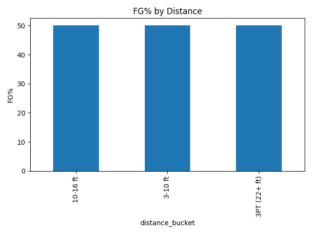
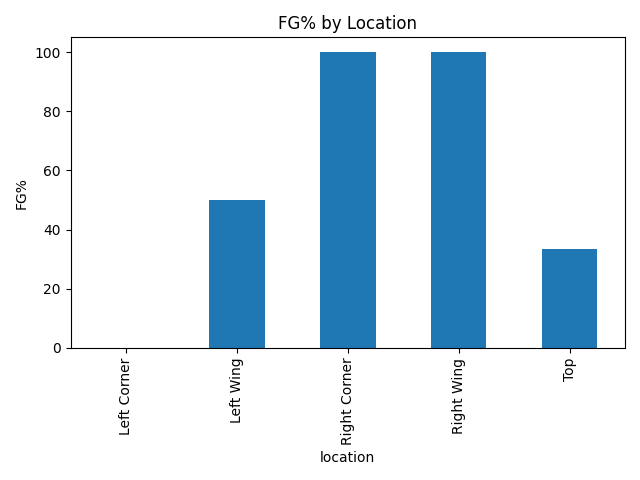

🏀 Basketball Shot Analysis

A simple Python data analysis project that takes basketball shot data from a CSV file, cleans it, and produces field goal percentage (FG%) charts by distance and location.

This project demonstrates basic data analysis skills (using Python, pandas, and matplotlib), and produces visual insights from raw data.

📊 Example Outputs
FG% by Location

FG% by Distance

⚙️ How to Run the Project (Windows)

1. Clone or download this repo

git clone https://github.com/MAlkadi25/basketball-shot-analysis

2. Create a virtual environment

python -m venv .venv
.venv\Scripts\activate

3. Install requirements

pip install -r requirements.txt

4. Run the analysis

python analyze_shots.py

📂 Outputs

Running the script will generate:

summary_overall.txt → Overall FG%

summary_by_distance.csv → FG% by distance buckets

summary_by_location.csv → FG% by court location

### FG% by Distance

### FG% by Location

🛠️ Tech Stack

Python 3.12

pandas

matplotlib

🚀 Next Steps

Replace shots_sample.csv with your own basketball data (game logs or practice shots).

Extend analysis: add shot type filters (2PT vs 3PT), contested vs open shots, etc.

Convert into a dashboard app using Streamlit
.

📌 About

This repo is part of my data portfolio, showing practical examples of:

Data cleaning

Aggregation & grouping in pandas

Chart visualization in matplotlib

End-to-end workflow (raw data → analysis → charts)
